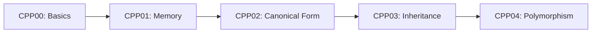
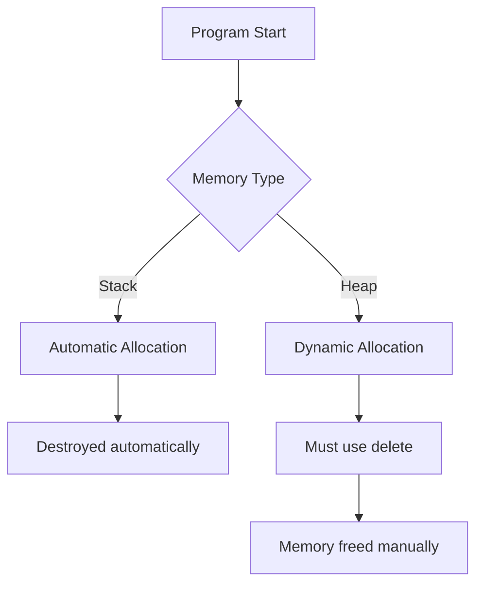
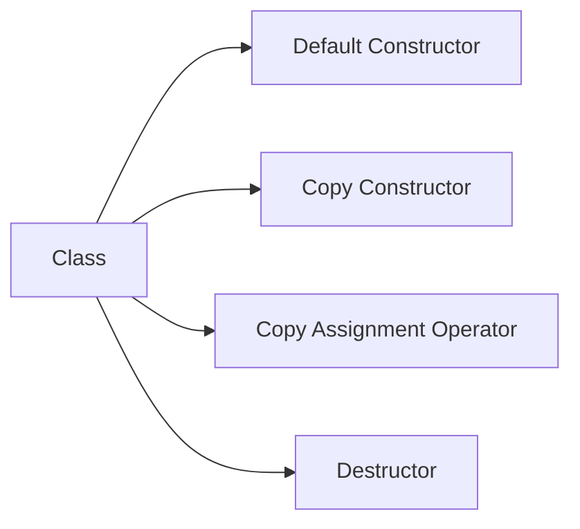
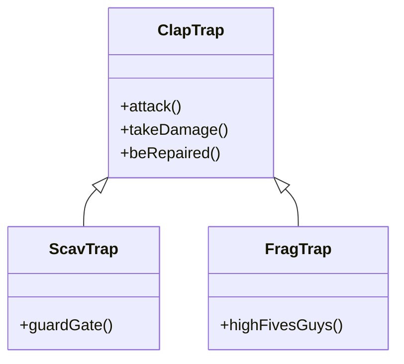
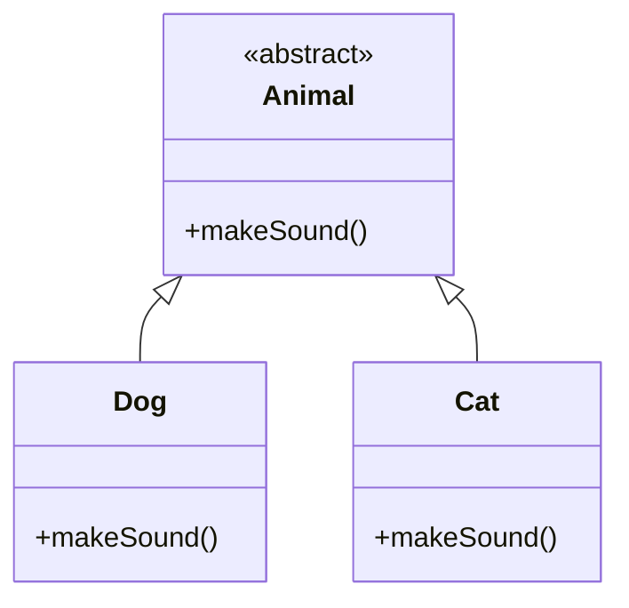
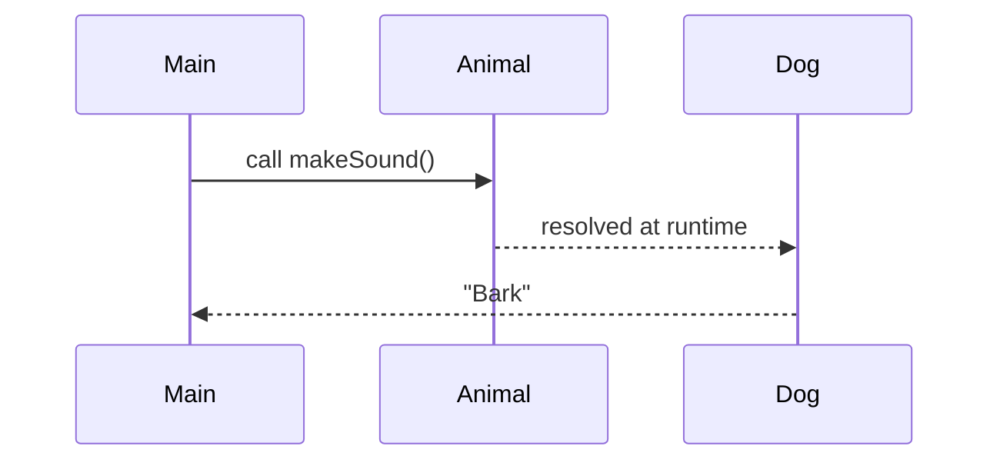

# 🚀 C++ Modules 00–04 — 42 School

> A practical and structured introduction to Object-Oriented Programming in C++ (C++98 standard), built through the 42 curriculum.

---

## 📌 Overview

This repository contains my implementations for **CPP00 → CPP04**, designed to help students transition from procedural programming in C to **Object-Oriented Programming (OOP)** in C++.

---

## 🧭 What do we learn in these modules?



---

## 🧠 Core Concepts Visualization

### 🧱 CPP00 — First Steps in C++

> *"From C to C++ mindset shift"*

* Namespaces (`std::`)
* Classes & member functions
* Streams (`std::cout`, `std::cin`)
* Basic encapsulation

✅ **Goal:** Understand how C++ structures code differently from C.

⚠️ **Common mistakes:**

* Forgetting `std::`
* Misunderstanding class vs struct
* Not separating `.hpp` / `.cpp`

📏 **Evaluator Tip (PhoneBook formatting):**

Some evaluators pay **special attention** to column alignment in the `PhoneBook` exercise.

* The output must be perfectly aligned using fixed-width columns.
* Vertical separators (`|`) must line up exactly.

💥 **Important detail:**
Only use **ASCII characters** in displayed strings.

Characters like:

* `á`, `é`, `ñ`, etc.

may visually take more space than expected, breaking alignment even if your code seems correct.

🧪 **Recommendation:**

* Stick to standard ASCII characters
* Use `std::setw()` for consistent formatting
* Test your output with different inputs

👉 Misalignment = very common reason for losing points in this exercise.


---

### 🧠 CPP01 — Stack vs Heap



💡 Stack = safer, Heap = more flexible but dangerous.

---

### ⚙️ CPP02 — Orthodox Canonical Form



---

### 🧬 CPP03 — Inheritance Hierarchy



💡 Child classes reuse and extend parent behavior.

---

### 🎭 CPP04 — Polymorphism



---

### 🔁 Virtual Function Behavior



💥 This is **runtime polymorphism**

---

## ⚙️ Compilation

```bash
c++ -Wall -Wextra -Werror -std=c++98
```

---

## 🔍 Debugging & Testing

### Memory leaks

```bash
valgrind --leak-check=full ./program
```

---

## ❗ Common Pitfalls

* Forgetting Orthodox Canonical Form
* Forgetting to add the flag -std=c++98
* Memory leaks (instant fail)
* Missing `virtual` destructor
* Object slicing in inheritance

---
