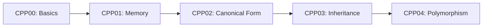
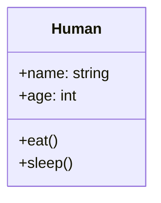
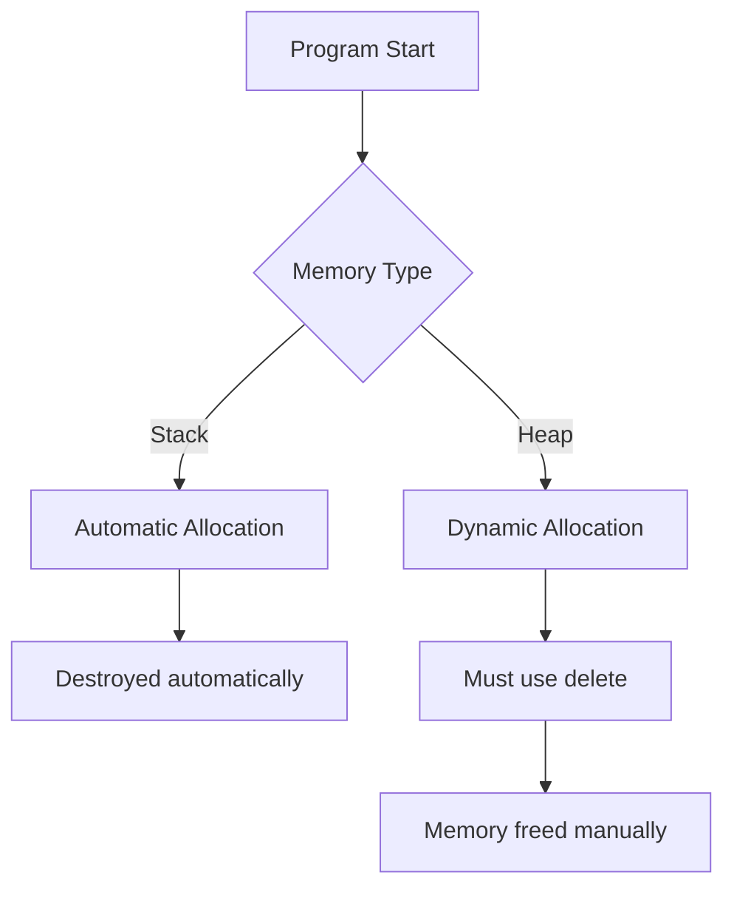
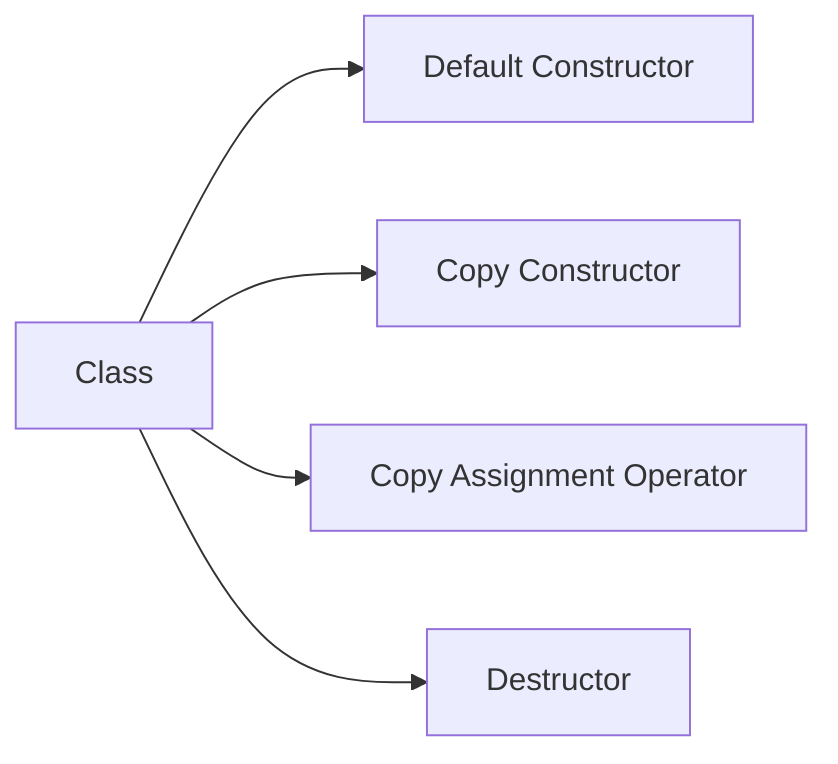
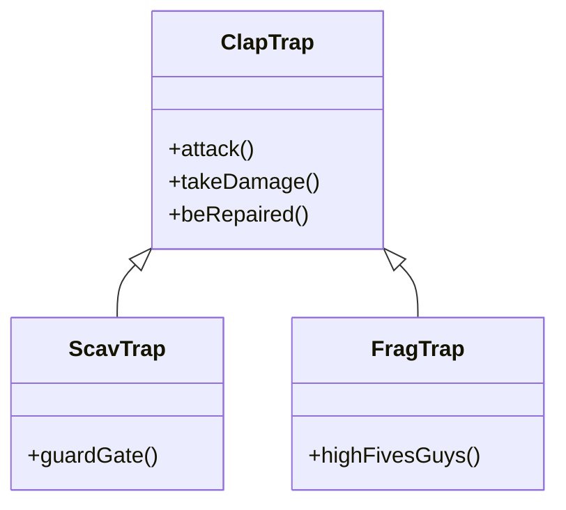
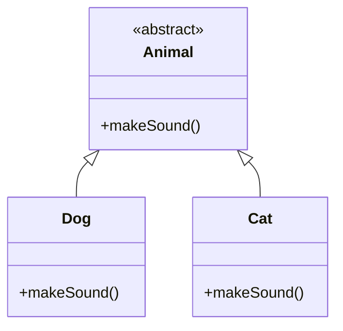
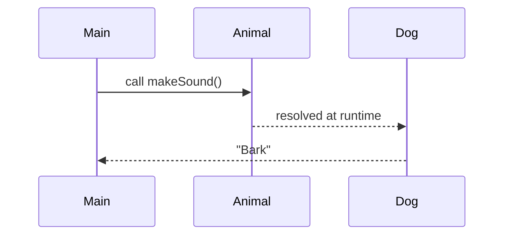

# 🚀 C++ Modules 00–04 — 42 School

> A practical and structured introduction to Object-Oriented Programming in C++ (C++98 standard), built through the 42 curriculum.

---

## 📌 Overview

This repository contains my implementations for **CPP00 → CPP04**, designed to help students transition from procedural programming in C to **Object-Oriented Programming (OOP)** in C++.

---

## 🧭 What do we learn in these modules?



---

## 🧠 Core Concepts Visualization

### 🧱 From Object to Class



---

### 🧠 CPP01: Stack vs Heap



💡 Stack = safer, Heap = more flexible but dangerous.

---

### ⚙️ CPP02: Orthodox Canonical Form



---

### 🧬 CPP03: Inheritance Hierarchy



💡 Child classes reuse and extend parent behavior.

---

### 🎭 CPP04: Polymorphism



---

### 🔁 Virtual Function Behavior



💥 This is **runtime polymorphism**

---

## ⚙️ Compilation

```bash
c++ -Wall -Wextra -Werror -std=c++98
```

---

## 🔍 Debugging & Testing

### Memory leaks

```bash
valgrind --leak-check=full ./program
```

---

## ❗ Common Pitfalls

* Forgetting Orthodox Canonical Form
* Forgetting to add the flag -std=c++98
* Memory leaks (instant fail)
* Missing `virtual` destructor
* Object slicing in inheritance

---

Master them, and CPP05+ becomes much easier.
